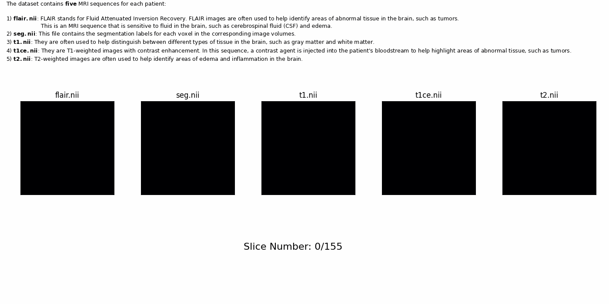

# BrainStain.ai

Brain tumor detector using U-NET architecture and Sorensen Dice Index metric. Trained on 3D NIfTI data. 


## Installation

Install my-project with npm.

```bash
  $ git clone https://github.com/yaashwardhan/BrainStain.ai.git
```
Navigate to the project directory.
```bash
  $ cd BrainStain.ai/
```
Create a new Conda environment.
```bash
  $ conda create --name environment-name python=3.10.10
```
Note: Replace environment-name with the name you want to give your Conda environment.

Activate the newly created environment.
```bash
  $ conda activate environment-name
```
Install the project dependencies from the requirements.txt file.
```bash
  $ pip install -r requirements.txt
```
Verify that all the required packages have been installed correctly by running:
```bash
  $ pip freeze
```
