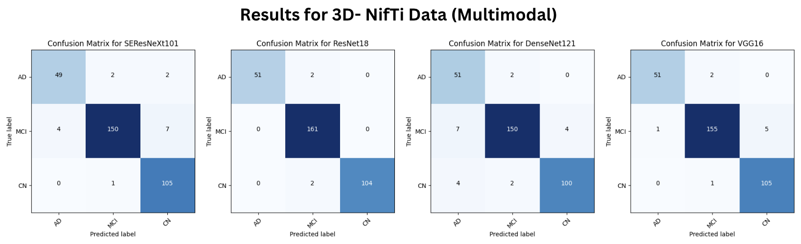
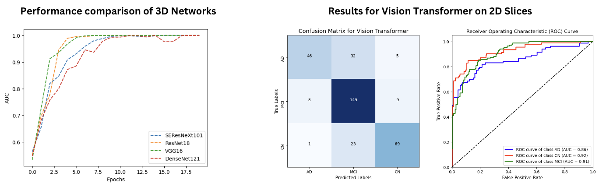

# BrainStain.ai :brain:

  

### :white_check_mark: **Module 1:** Brain tumor segmentation using U-NET architecture and Sorensen Dice Index metric. Trained on [3D NIfTI data](https://www.med.upenn.edu/cbica/brats2020/data.html). 

### :white_check_mark: **Module 2:** Multimodal Transfer Learning Approach for Alzheimer’s Disease Stage Classification Using 3D Convolutional Neural Networks. Trained on [ADNI data](https://adni.loni.usc.edu/). 

#### **For 3D NifTi data**: 
 - Implemented 3D-CNNs:
    - SEResNeXt101 `(0.9879 Val AUC)`
    - ResNet18 `(0.9982 Val AUC)`
    - VGG-16 `(0.9989 Val AUC)`
    - DenseNet121 `(0.9902 Val AUC)`
 - Built a multimodal approach. Modalities of the patient used are:
    - Gender
    - Age
    - Frequency of Visit
    - Patient ID

#### **For 2D data**: The 2D data was created by taking the middle slice of the 3D NifTi data. 
 - Implemented:
    - ViT-B_32 with imagenet21k weights (0.86 val AUC)

## Dependencies (Module 1)

| Package           | Tested version |
|--------------------|----------------|
| tensorflow         | 2.11.0         |
| keras              | 2.10.0         |
| opencv_python      | 4.7.0.68       |
| nibabel            | 5.0.1          |
| numpy              | 1.23.3         |
| pandas             | 1.5.0          |
| matplotlib         | 3.6.0          |
| scikit_learn       | 1.2.2          |
| SimpleITK          | 2.2.1          |
| ipython            | 8.11.0         |

